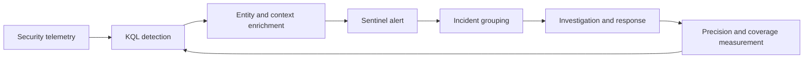

# Microsoft Sentinel Analytics Rules

A focused detection-as-code library for Microsoft Sentinel covering identity, endpoint, cloud, Microsoft Purview, AI security, Microsoft Agent 365, and UEBA.

Every rule is an adaptable example. Validate connector identifiers, table schemas, thresholds, entity mappings, grouping, and expected alert volume in a non-production workspace before enablement.

## Architecture



## Rule domains

| Domain | Example coverage |
|---|---|
| AI security | Repeated prompt-injection indicators |
| Agent 365 | Risky or unauthorized agent tool use |
| Identity | Password spraying |
| Purview | AI activity correlated with mass file operations |
| Cloud | Azure resource deletion |
| Endpoint | Suspicious PowerShell execution |
| UEBA | Privileged-identity anomaly |

Browse the generated [rule catalog](docs/rule-catalog.md) for tables, severity, ATT&CK mappings, entities, and versions.

## Repository structure

```text
analytics-rules/        Scheduled rule YAML organized by domain
docs/                   Authoring, architecture, schema, and validation guidance
scripts/                Static validation and catalog generation
tests/fixtures/          Self-contained KQL logic fixtures
.github/workflows/      Pull-request validation
```

## Validate

```bash
python3 -m pip install -r requirements-dev.txt
python3 scripts/validate_rules.py
python3 scripts/generate_catalog.py --check
```

Static validation does not prove that a rule compiles against tenant data. See [validation strategy](docs/validation-strategy.md) for workspace-backed testing requirements.

See the [coverage matrix](docs/coverage-matrix.md) for current behavioral and telemetry coverage, and [deployment guidance](deployment/README.md) before attempting tenant deployment.

## Validation labels

- **Example** — structurally reviewed, but not executed against representative telemetry.
- **Lab Tested** — executed with controlled positive and negative scenarios.
- **Production Validated** — operated against representative production telemetry with documented results.

## Notice

This repository is a professional cybersecurity portfolio and defensive research project. Unsolicited community contributions, issue submissions, and feature requests are not currently accepted. Content is provided as-is and must be reviewed, tested, authorized, and tuned before production deployment.
