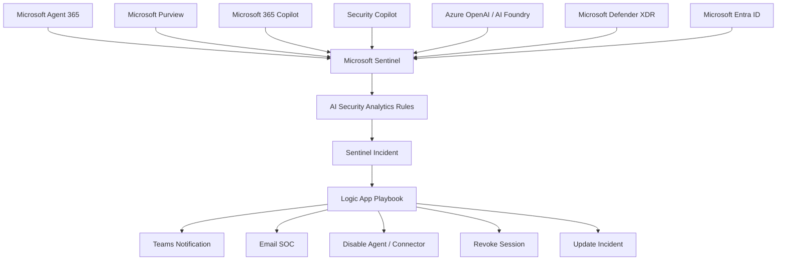

# AI Security Operations Architecture

```mermaid
flowchart TD
    A[Microsoft Agent 365] --> S[Microsoft Sentinel]
    B[Microsoft Purview] --> S
    C[Microsoft 365 Copilot] --> S
    D[Security Copilot] --> S
    E[Azure OpenAI / AI Foundry] --> S
    F[Microsoft Defender XDR] --> S
    G[Microsoft Entra ID] --> S

    S --> H[AI Security Analytics Rules]
    H --> I[Sentinel Incident]
    I --> J[Logic App Playbook]
    J --> K[Teams Notification]
    J --> L[Email SOC]
    J --> M[Disable Agent / Connector]
    J --> N[Revoke Session]
    J --> O[Update Incident]
```
