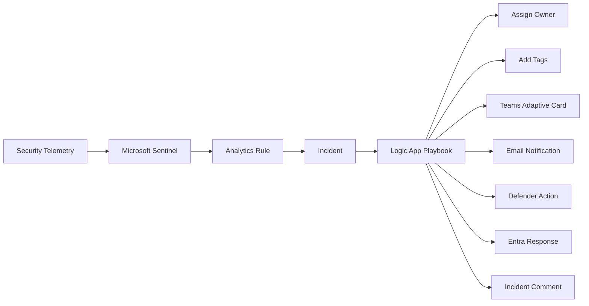

# Sentinel SOAR Architecture

```mermaid
flowchart LR
    A[Security Telemetry] --> B[Microsoft Sentinel]
    B --> C[Analytics Rule]
    C --> D[Incident]
    D --> E[Logic App Playbook]

    E --> F[Assign Owner]
    E --> G[Add Tags]
    E --> H[Teams Adaptive Card]
    E --> I[Email Notification]
    E --> J[Defender Action]
    E --> K[Entra Response]
    E --> L[Incident Comment]
```
