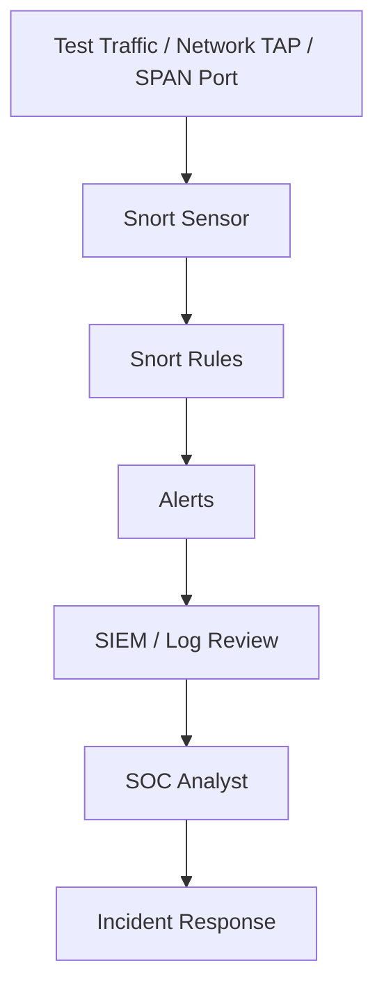

# Snort Detection Architecture

```mermaid
flowchart TD
    A[Test Traffic / Network TAP / SPAN Port] --> B[Snort Sensor]
    B --> C[Snort Rules]
    C --> D[Alerts]
    D --> E[SIEM / Log Review]
    E --> F[SOC Analyst]
    F --> G[Incident Response]
```
