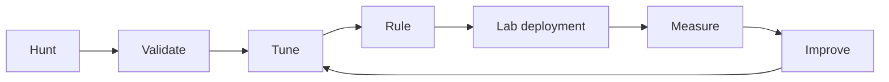

# Detection Lifecycle

A detection is mature only when its telemetry assumptions, expected positives, expected benign activity, alert behavior, response ownership, and known blind spots are documented and periodically reviewed.
