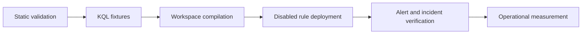

# Validation Strategy

## Static checks

`scripts/validate_rules.py` verifies YAML, GUIDs, schedule coverage, `TimeGenerated`, final output columns, dynamic alert fields, and fixtures.

## Logic fixtures

Self-contained `datatable()` fixtures exercise transparent pieces of detection logic. They complement—but do not replace—connector-backed testing.

## Workspace validation

Compile each query in a non-production Sentinel workspace with the declared tables and parsers. Confirm field types, ingestion delays, mapped entities, custom details, grouping, and expected positive and negative outcomes.

Workspace integration is not enabled in the public workflow because it requires an authorized Azure tenant, test workspace, populated connectors, controlled data, and protected OIDC configuration.
