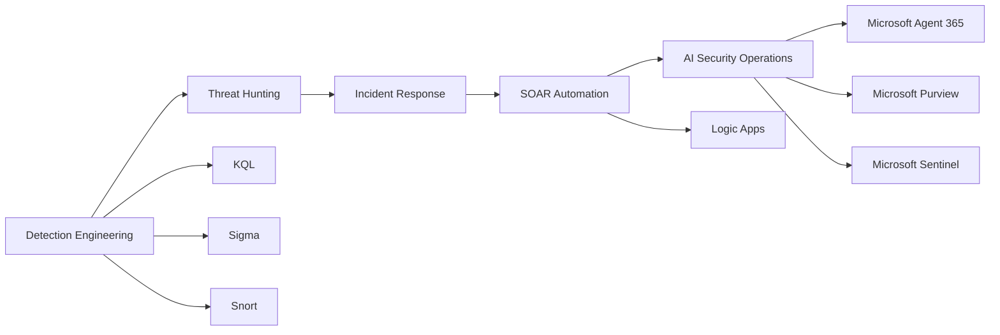

# Leandro Rocha

Cybersecurity professional focused on **Incident Response**, **Detection Engineering**, **Threat Hunting**, **Microsoft Sentinel**, **Microsoft Defender XDR**, **SOAR Automation**, and **AI Security Operations**.

## Focus Areas

- Incident Response modernization
- Detection engineering with KQL, Sigma, and Snort
- Microsoft Sentinel analytics rules
- Microsoft Defender XDR investigations
- Microsoft Purview data security and exfiltration correlation
- Microsoft Agent 365 and AI agent security
- Microsoft 365 Copilot and Security Copilot monitoring
- Azure Logic Apps / SOAR automation
- Threat hunting and SOC enablement

## Featured Projects

| Project | Description |
|---|---|
| [IncidentResponse](https://github.com/leandroer/IncidentResponse) | Professional incident response website and technical IR reference |
| [AI-Security-Incident-Response-Lab](https://github.com/leandroer/AI-Security-Incident-Response-Lab) | AI Security IR framework mapped to OWASP GenAI Top 10, Microsoft Agent 365, Purview, Sentinel, and Logic Apps |
| [KQL-Templates](https://github.com/leandroer/KQL-Templates) | KQL templates, hunting queries, detection engineering patterns, and analyst learning resources |
| [Snort-Detection-Engineering-Lab](https://github.com/leandroer/Snort-Detection-Engineering-Lab) | Snort 3 detection engineering, IDS/IPS deployment, packet analysis, and network threat detection |
| [Sentinel-Analytics-Rules](https://github.com/leandroer/Sentinel-Analytics-Rules) | Microsoft Sentinel analytics rules for identity, data security, AI security, and agentic threats |
| [Sigma-Templates](https://github.com/leandroer/Sigma-Templates) | Sigma detection templates and portable detection logic |

## Security Engineering Portfolio

## Core Technologies

## Current Portfolio Direction

I am building practical, technical, and professional security engineering projects that help defenders understand, detect, investigate, and respond to modern threats across cloud, identity, endpoint, network, data, and AI systems.

## Contact

- GitHub: [leandroer](https://github.com/leandroer)
