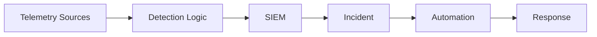

# Project Name

Professional one-sentence summary explaining what the project does and who it helps.

## Overview

Explain the project purpose, target audience, and security value.

## Who This Is For

| Role | Value |
|---|---|
| SOC Analyst | Investigation and triage guidance |
| Detection Engineer | Detection logic and tuning |
| Incident Responder | Response workflow |
| Security Architect | Telemetry and architecture guidance |

## Architecture



## Repository Structure

```text
.
├── docs/
├── detections/
├── playbooks/
├── scripts/
└── README.md
```

## Getting Started

```bash
git clone <repo-url>
cd <repo-name>
```

## Detection Engineering Content

Each detection should include:

- Objective
- Required data sources
- Query/rule logic
- Expected output
- False positives
- Tuning guidance
- Response guidance

## Disclaimer

This project is intended for defensive security operations, detection engineering, and incident response education.
